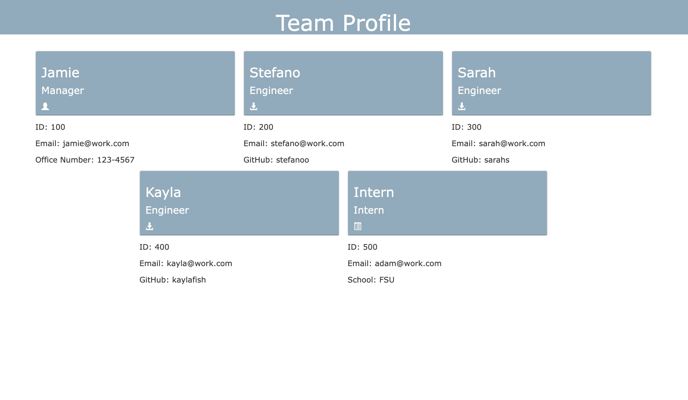

# team-creator

## Description 

 Team-creator is a command-line-input application with Node that allows for the user to build their team! It allows for the user to input their name, role within the comapny with a choice from Manager, Engineer and Intern. They also are to provide their email and the choice for office number for a manager, github for the engineers, and the shcool if they are an intern. 

## Technologies 
<ul>
    <li> HTML
    <li> CSS
    <li> JavaScript
</ul>

## Demo Video

 Watch the demo video by clicking the link!

[Demo Video](https://drive.google.com/file/d/1vjhKOn4KYI-TeKcG34COcG4KNnO3zJ_s/view)

## Screenshots

## Link
[team-creator]()
